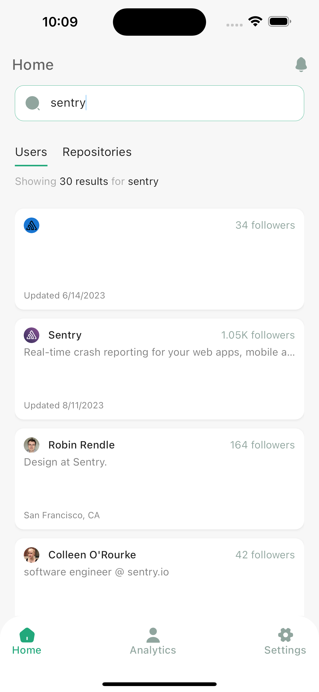
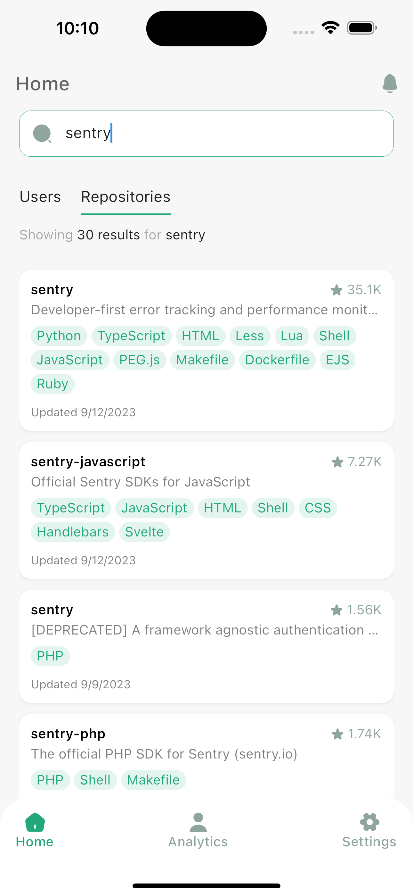
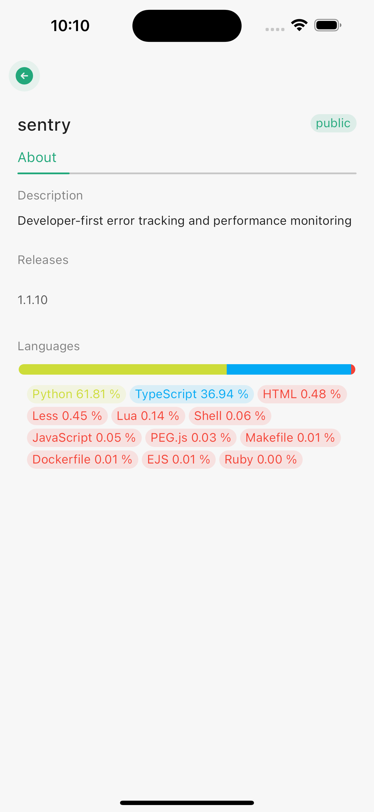
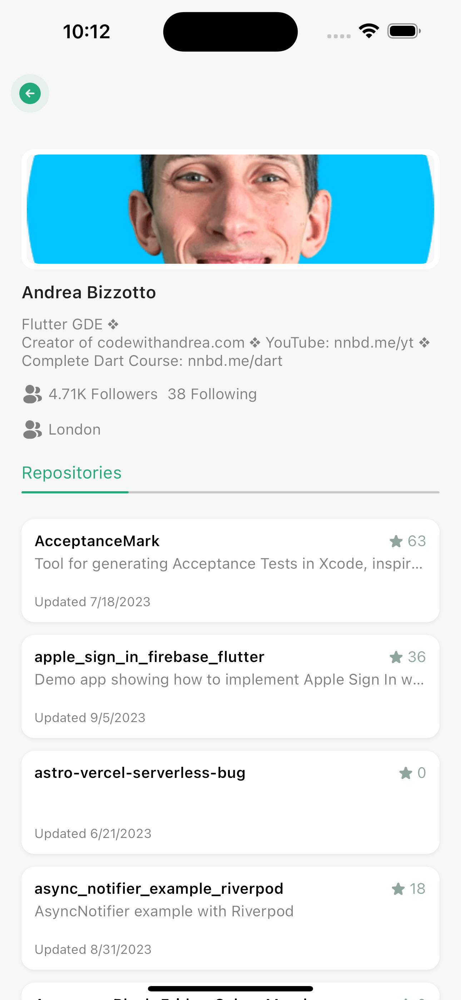

# GitHub User and Repository Search App

This is a simple mobile app built with Flutter that allows you to search for GitHub users and repositories.

## Features

- Search for GitHub users by username.
- Search for GitHub repositories by keywords.
- View user profiles with details like name, bio, and avatar.
- View repository details including the owner, description, and stars.

## Screenshots






## Getting Started

To get started with this app, follow these steps:

1. **Prerequisites**: Make sure you have Flutter and Dart installed on your development machine. If not, you can follow the official [Flutter installation guide](https://flutter.dev/docs/get-started/install).

2. **Clone the Repository**: Clone this repository to your local machine using Git:

   ```bash
   git clone https://github.com/princenyamadi/github_app


3. **  Get Packages and Dependencies
     ```bash
     flutter run pub get

4. **Add env file and variables**: Add environment file `.env` and set your github token to `GITHUB_TOKEN` in the env file


5. **Run the app**
     ```bash
     flutter run 